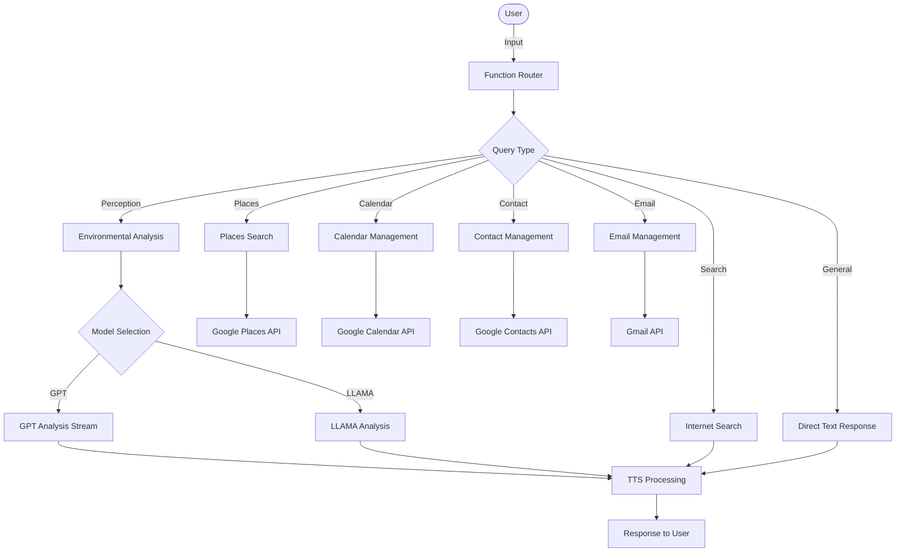

<div align="center">

# ✨ Intelligent Perception Assistant ✨

### An AI-Powered Multimodal Accessibility Assistant for Visually Impaired Users

_Enhancing environmental awareness through intelligent AI perception_

</div>

---

## 📋 Overview

Intelligent Perception Assistant is an AI-powered accessibility system designed to assist visually impaired users by providing real-time environmental understanding and contextual guidance. The system combines multimodal perception, natural language processing, speech interaction, and intelligent reasoning to help users better interpret their surroundings and interact more confidently with the world.

The assistant transforms real-world inputs into meaningful feedback, enabling natural interaction, contextual awareness, and intelligent assistance that enhances independence, safety, and accessibility.

---

## 🏗️ System Architecture



---

## ✨ Key Features

### 🔄 Multimodal Perception Approach

- Intelligent scene understanding and contextual analysis
- Adaptive processing using multiple AI models
- Privacy-aware descriptions focused on useful information

### 🌊 Real-time Response Streaming

- Progressive output for faster interaction
- Natural conversational responses with minimal latency
- Immediate feedback during queries

### 🧭 Accessibility-Focused Design

- Detailed environment descriptions tailored for visually impaired users
- Speech-first interaction model for ease of use
- Concise yet informative contextual analysis

### 🎭 Virtual Avatar Integration

- Optional visual representation for remote communication
- Helps improve interaction with sighted users during calls or meetings

### 🧩 Comprehensive Capabilities

- Natural conversational interaction
- Environmental awareness and contextual understanding
- Internet search and location services
- Calendar, contact, and email integration
- Modular architecture for future expansion

---

## 🔧 Technical Implementation

### Model Selection

Primary AI models enable intelligent perception and contextual reasoning:

| Criteria              | Performance                           |
| :-------------------- | :------------------------------------ |
| Response Time         | Optimized for low-latency interaction |
| Streaming             | Token-by-token streaming responses    |
| Context Understanding | Advanced multimodal reasoning         |
| Reliability           | High accuracy during testing          |

---

## 🗂️ Project Structure

```
Ally/
├── app.py
├── requirements.txt
├── .env
├── images/
└── src/
    ├── main.py
    ├── config.py
    ├── utils.py
    └── tools/
```

---

## 🚀 Getting Started

### Prerequisites

- Python 3.9+
- LiveKit API
- OpenAI API
- Deepgram API
- ElevenLabs API
- Groq API
- Google APIs

---

### Installation

```
git clone https://github.com/AayushKrGupta/Intelligent-Perception-Assistant-for-Visually-Impaired.git
cd Intelligent-Perception-Assistant-for-Visually-Impaired

python -m venv venv
source venv/bin/activate
pip install -r requirements.txt
```

---

### Configure Environment

Create `.env` file:

```
OPENAI_API_KEY=
GROQ_API_KEY=
LIVEKIT_URL=
LIVEKIT_API_KEY=
LIVEKIT_API_SECRET=
DEEPGRAM_API_KEY=
ELEVEN_API_KEY=
GPLACES_API_KEY=
```

---

### Run Application

```
python app.py start
```

---

## 📄 License

This project is intended for educational and research purposes.

---

<div align="center">

## 📞 Contact

For questions, feedback, or collaboration:

📧 Email: aayushkr.dev@gmail.com  
💼 LinkedIn: https://www.linkedin.com/in/AayushKrGupta  
🐙 GitHub: https://github.com/AayushKrGupta

Feel free to open an issue or connect directly.

</div>
